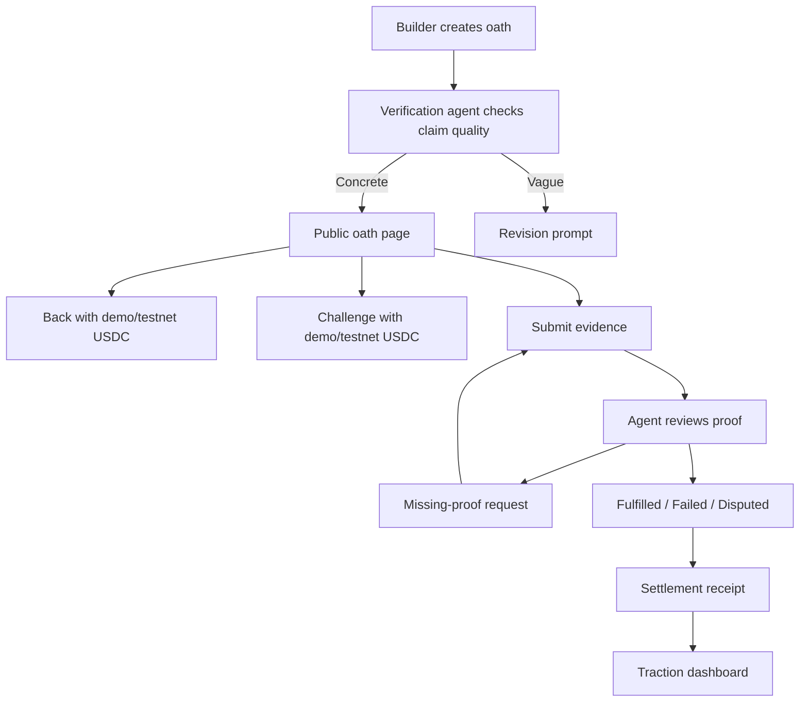
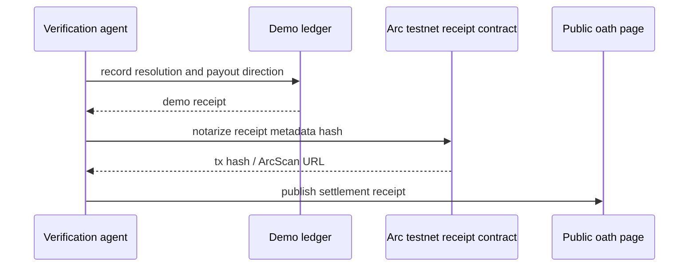

# feat: Build 0ath proof-of-ship markets

> Superseded by `docs/plans/2026-05-22-002-feat-0ath-agent-operated-markets-plan.md` after ce-doc-review repaired the requirements thesis.

## Summary

Build 0ath as a greenfield, demo-first web app with public proof-of-ship oath pages, USDC-denominated backing/challenge flows, evidence submission, agent verification, live Arc testnet receipt notarization, and judge-readable traction metrics. The winning path is not the smallest shippable demo; it is a stable public product loop plus real Arc artifacts plus visible participant activity. Production custody and real-money controls stay out of scope, but testnet onchain proof is required.

---

## Problem Frame

The origin requirements define a builder-first commitment market for Agora teams that need public, inspectable evidence of shipping progress. The implementation plan assumes engineering throughput is not the bottleneck. The real bottlenecks are external credibility, judge comprehension, Arc/Circle integration proof, and traction before the May 25 deadline. V1 should therefore include real Arc testnet notarization while still avoiding production custody, legal/compliance exposure, and sprawling market categories.

---

## Requirements

**Oath creation**
- R1. Builders can create oaths with concrete claims, deadlines, and proof requirements.
- R2. Vague claims are rejected or flagged before publication.
- R3. Each oath has a public page understandable without sign-in.

**Backing and challenge**
- R4. Users can back or challenge oaths through demo/testnet USDC-denominated commitments.
- R5. Oath pages show backing, challenge, and participant activity clearly.
- R6. Economic actions are framed as commitment/accountability, not generic gambling.

**Evidence and verification**
- R7. Users can submit links, screenshots, tx hashes, repo activity, deployment URLs, and notes as proof.
- R8. The verification agent produces readable reasoning over inspected evidence.
- R9. Missing evidence is surfaced with an evidence request or bounty-style receipt.
- R10. Oaths support fulfilled, failed, and disputed states.

**Settlement and traction**
- R11. Resolved oaths produce settlement receipts with status, payout direction, reasoning, and USDC/Arc activity.
- R12. Circle/Arc usage is central through USDC commitments, settlement, and proof receipts.
- R13. The MVP supports onboarding real Agora teams or participants before submission.
- R14. Judges can inspect traction metrics: oaths, participants, evidence, commitments, and outcomes.

**Origin actors:** A1 builder team, A2 backer, A3 challenger, A4 evidence contributor, A5 verification agent, A6 judge or reviewer.
**Origin flows:** F1 create a shipping oath, F2 back or challenge an oath, F3 verify proof and resolve.
**Origin acceptance examples:** AE1 vague oath rejection, AE2 backing commitment update, AE3 fulfilled proof review, AE4 missing Arc proof handling, AE5 public settlement receipt.

---

## Scope Boundaries

### Deferred for later

- Real-money mainnet risk controls and legal/compliance handling.
- Broad public prediction markets for sports, politics, tokens, or macro events.
- Fully decentralized oracle governance with juries, appeals, and complex dispute markets.
- Advanced agent competitions, forecasting leaderboards, and reusable agent trace marketplaces.
- Support for many unrelated communities beyond the Agora builder use case.

### Outside this product's identity

- Generic AI trading bots or portfolio managers.
- A Polymarket clone.
- A generic x402 or agent API marketplace.
- A judge-only audit tool with no builder traction loop.
- A social betting game where proof and shipping accountability are secondary.

### Deferred to Follow-Up Work

- Production wallet custody, KYC, and real-money settlement controls.
- Full Circle Nanopayments/x402 evidence bounty settlement. V1 preserves the product concept with USDC-denominated evidence requests and receipts.
- Production payout contracts that custody real user funds.
- Fully generalized onchain dispute games, juries, appeals, and oracle governance.
- Automated Discord/X scraping. V1 should rely on explicit proof submissions and optional public URL checks.

---

## Context & Research

### Relevant Code and Patterns

- No app code exists yet. The plan is greenfield and should create the product structure from scratch.
- The only local source of truth is `docs/brainstorms/2026-05-22-0ath-requirements.md`.

### Institutional Learnings

- Keep the hackathon artifact focused: one strong judge-readable product flow with real Arc receipts beats many unfinished features.
- Preserve a tight main strategy while keeping broader future ideas out of the active build.
- Avoid generic trading-bot and agent-marketplace patterns; the wedge is proof, accountability, and settlement.

### External References

- Arc App Kits provide Send, Bridge, Swap, and Unified Balance through a type-safe SDK and support application monetization through custom fees: https://docs.arc.io/app-kit/
- Arc Testnet uses USDC as the native gas token and has chain ID `5042002`, RPC `https://rpc.testnet.arc.network`, explorer `https://testnet.arcscan.app`, and faucet access through Circle: https://docs.arc.io/arc/references/connect-to-arc
- Arc deployment docs show Foundry-based testnet deployment, use of `ARC_TESTNET_RPC_URL`, and confirmation on ArcScan: https://docs.arc.io/integrate/deploy-on-arc
- Circle Nanopayments require Gateway deposits, EOA signing, and EIP-3009 offchain authorizations; this is valuable but depends on more external setup than receipt notarization, so it belongs in a parallel stretch lane: https://developers.circle.com/gateway/nanopayments/quickstarts/buyer
- Circle Gateway batches signed nanopayment authorizations and can amortize per-payment gas down to very small payments, which fits future evidence bounties: https://developers.circle.com/gateway/nanopayments/concepts/batched-settlement
- Vercel Marketplace storage provides Redis/KV-style integrations suitable for lightweight public app state: https://vercel.com/docs/storage

---

## Key Technical Decisions

- Greenfield Next.js app: use a single web app so oath creation, public proof pages, agent reasoning, receipts, and traction are all judge-clickable in one place.
- Durable demo persistence: use a Redis/KV-style store provisioned through Vercel Marketplace for deployed public app state, with seed data as fallback for local development.
- Required Arc receipt notarization: resolved oaths must write receipt metadata to Arc testnet through the simplest verifiable contract/event path. The app keeps a demo/testnet ledger for UX and resilience, but at least one live ArcScan-visible receipt is a submission blocker.
- Agent verification as deterministic-first: start with rule-based claim/evidence checks plus generated reasoning summaries; deeper LLM orchestration can be added only after the base flow is reliable.
- Evidence bounties as receipts first: represent missing-proof requests in the product and reserve real Nanopayments/x402 settlement for a parallel stretch lane after the Arc receipt path works.
- Public pages over authenticated dashboards: judges and participants must be able to inspect the core loop without account setup.

---

## Open Questions

### Resolved During Planning

- Settlement depth: v1 uses a hybrid path, with a demo/testnet ledger for readable commitment accounting and live Arc testnet receipt notarization for credible settlement proof.
- Persistence: deployed app state uses Redis/KV-style storage through Vercel Marketplace, with local seed fallback.
- Automated proof sources: v1 accepts all origin proof types, but auto-verifies only required-category presence, URL shape or reachability, GitHub/deploy URL presence, and Arc tx/explorer link shape. Screenshots and notes are stored and cited, not parsed.
- Evidence bounties: v1 represents them as USDC-denominated evidence requests and receipts; real Nanopayments/x402 can run as a parallel stretch lane.
- Arc minimum: deploy a receipt-only Arc testnet contract or equivalent write path, notarize at least one resolved oath, and show the ArcScan reference in the product and README.
- Traction path: seed the app with our own 0ath commitment, deploy publicly, then invite Agora/Canteen/Arc Discord participants to create or back oaths.

### Deferred to Implementation

- Exact verification scoring thresholds: implementation should tune the threshold labels once sample oaths and evidence are in the app.

---

## Output Structure

    app/
      page.tsx
      oaths/
        new/page.tsx
        [id]/page.tsx
      dashboard/page.tsx
      api/
        oaths/route.ts
        oaths/[id]/evidence/route.ts
        oaths/[id]/positions/route.ts
        oaths/[id]/resolve/route.ts
    components/
      oath/
      ui/
    lib/
      agent/
      arc/
      data/
      domain/
    contracts/
      src/
      test/
    tests/
      unit/
      integration/
      e2e/
    public/
    README.md
    docs/demo-checklist.md

The tree is a scope declaration, not a constraint. `contracts/` is part of the required winning path, but only for receipt notarization. It must not hold funds or block the public product loop if the testnet is temporarily unavailable.

---

## High-Level Technical Design

> *This illustrates the intended approach and is directional guidance for review, not implementation specification. The implementing agent should treat it as context, not code to reproduce.*

---

## Implementation Units

## May 25 Critical Path

- P0 product: one seeded 0ath commitment, create/view oath, back/challenge, submit evidence, deterministic verification, missing-proof request, settlement receipt, traction dashboard, README, public deployment.
- P0 Arc/Circle proof: deploy or use a receipt-only Arc testnet write path, notarize at least one resolved oath, show Arc Testnet chain ID `5042002`, USDC testnet/gas labeling, and an ArcScan link in-product.
- P0 traction: onboard at least a few real Agora/Canteen/Arc participants into backing, challenging, creating, or submitting evidence before submission.
- P1 stretch: Circle Nanopayments/x402 evidence payouts, broader proof automation, richer LLM analysis, multi-community support, and signed agent feeds.
- Verification bar: unit tests for claim quality, resolution policy, and metrics; one Playwright demo smoke path; one manual browser checklist for responsive and public-page proof.

## Parallel Execution Plan

- Do not sequence this like a single-engineer project. Streams A-E should run in parallel, with daily integration around the judge path and live Arc receipt.
- Stream A, product shell: U1, U3, U4, and UI polish.
- Stream B, data and persistence: U2 plus deployed Redis/KV setup and seed fixtures.
- Stream C, verification agent: U5 rule engine, reasoning trace, missing-proof policy, and resolution states.
- Stream D, Arc integration: U6 contract, deployment script, receipt adapter, ArcScan proof, and docs.
- Stream E, traction and submission: U7 public dashboard, README, demo checklist, Discord outreach copy, video path, and final submission assets.
- Stream F, stretch monetization: U8 Nanopayments/x402 evidence bounty prototype only after Streams A-D are demonstrably working.

### U1. Scaffold the greenfield app and design system baseline

**Goal:** Create the application shell, routing structure, styling baseline, and shared UI primitives needed for all 0ath flows.

**Requirements:** R3, R6, R13, R14

**Dependencies:** None

**Files:**
- Create: `package.json`
- Create: `app/page.tsx`
- Create: `app/layout.tsx`
- Create: `app/globals.css`
- Create: `components/ui/`
- Create: `components/oath/`
- Create: `lib/domain/`
- Create: `tests/unit/`
- Create: `tests/e2e/`

**Approach:**
- Use a single web app with a first-screen product experience, not a marketing landing page.
- Establish visual language around proof, commitment, and settlement rather than trading or casino metaphors.
- Provide shared components for status badges, commitment amounts, evidence cards, reasoning panels, and receipts.
- Seed the home page with the core product loop and a path to create the first oath.

**Patterns to follow:**
- Follow the local frontend guidance from AGENTS.md: actual usable experience first, restrained utility-focused interface, no generic AI-gradient dashboard.

**Test scenarios:**
- Happy path: landing page renders the product loop and exposes create-oath navigation.
- Happy path: shared status and amount components render fulfilled, failed, disputed, active, backed, and challenged states consistently.
- Edge case: long oath titles and proof labels wrap without layout overlap.

**Verification:**
- The app shell loads without console-breaking errors and gives judges an immediate path into the product.

---

### U2. Define the 0ath domain model and demo persistence

**Goal:** Establish domain entities and persistence behavior for oaths, positions, evidence, verification runs, settlement receipts, and traction metrics.

**Requirements:** R1, R3, R4, R5, R7, R10, R11, R14

**Dependencies:** U1

**Files:**
- Create: `lib/domain/oath.ts`
- Create: `lib/domain/evidence.ts`
- Create: `lib/domain/position.ts`
- Create: `lib/domain/receipt.ts`
- Create: `lib/data/store.ts`
- Create: `lib/data/seed.ts`
- Create: `lib/data/kv-store.ts`
- Test: `tests/unit/domain.test.ts`
- Test: `tests/unit/store.test.ts`

**Approach:**
- Model oath lifecycle states clearly: draft or active before resolution, then fulfilled, failed, or disputed.
- Store demo/testnet commitments as USDC-denominated entries with side, participant label, amount, and timestamp.
- Treat settlement receipts as first-class records that reference demo/testnet ledger activity and live Arc testnet notarization data when available.
- Include seed data for a real 0ath team commitment so the demo works before external users arrive.
- Back deployed state with Redis/KV-style storage through Vercel Marketplace; use seeded/local fallback only for local development and demo recovery.

**Patterns to follow:**
- Use plain domain objects and small data helpers before introducing heavier infrastructure.

**Test scenarios:**
- Happy path: creating an oath persists claim, deadline, proof requirements, and public status.
- Happy path: backing and challenge positions update visible totals without mutating the original claim.
- Happy path: adding evidence appends to the evidence trail and updates traction metrics.
- Edge case: empty store returns seeded demo data or a clear empty state, not a crash.
- Error path: invalid status transitions are rejected.
- Integration: traction metrics aggregate across multiple oaths, positions, evidence submissions, and receipts.

**Verification:**
- Domain tests prove the lifecycle and metric behavior before UI depends on it.

---

### U3. Build oath creation and public oath pages

**Goal:** Let builders create concrete shipping oaths and expose each oath as a public page that judges can understand without signing in.

**Requirements:** R1, R2, R3, R5, R6; F1; AE1

**Dependencies:** U1, U2

**Files:**
- Create: `app/oaths/new/page.tsx`
- Create: `app/oaths/[id]/page.tsx`
- Create: `app/api/oaths/route.ts`
- Create: `components/oath/oath-form.tsx`
- Create: `components/oath/oath-page.tsx`
- Create: `lib/agent/claim-quality.ts`
- Test: `tests/unit/claim-quality.test.ts`
- Test: `tests/integration/oath-creation.test.ts`
- Test: `tests/e2e/oath-create-and-view.spec.ts`

**Approach:**
- The creation flow should ask for claim, deadline, proof requirements, and stake terms. If the builder skips stake terms, v1 should apply clear default demo/testnet terms rather than leaving the oath economically undefined.
- Claim-quality checks should flag vague commitments and nudge builders toward verifiable proof sources.
- The public oath page should show claim, deadline, proof requirements, backing/challenge totals, evidence trail, agent status, and next action.
- Language should emphasize public commitment and proof, not betting.

**Execution note:** Implement claim-quality behavior test-first because vague-oath rejection is the first acceptance example and protects product clarity.

**Patterns to follow:**
- Use the origin requirements' examples as copy anchors for vague versus concrete oaths.

**Test scenarios:**
- Covers AE1. Happy path: a concrete claim with deadline and proof requirements creates a public oath.
- Covers AE1. Error path: "we will do something cool" is flagged as too vague and does not publish as a resolvable oath.
- Happy path: public oath page is accessible without authentication.
- Happy path: navigation from home to oath creation works once the creation route exists.
- Edge case: deadline in the past is rejected or clearly marked invalid.
- Edge case: proof requirements with multiple sources render as a readable checklist.
- Integration: created oath appears in public navigation or listing surfaces.

**Verification:**
- A builder can create the first 0ath commitment and share a public URL.

---

### U4. Implement backing, challenge, and participant activity

**Goal:** Add the economic commitment layer so users can back or challenge an oath and see visible USDC-denominated activity.

**Requirements:** R4, R5, R6; F2; AE2

**Dependencies:** U2, U3

**Files:**
- Create: `app/api/oaths/[id]/positions/route.ts`
- Create: `components/oath/position-actions.tsx`
- Create: `components/oath/commitment-ledger.tsx`
- Modify: `components/oath/oath-page.tsx`
- Test: `tests/unit/position-ledger.test.ts`
- Test: `tests/integration/oath-position.test.ts`
- Test: `tests/e2e/oath-back-challenge.spec.ts`

**Approach:**
- Support back and challenge actions with participant name, side, amount, and optional note.
- Use demo/testnet USDC labels clearly so the demo avoids real-money ambiguity.
- Show participant activity as a public commitment ledger with totals for both sides.
- Prevent activity on resolved oaths unless implementation explicitly supports post-resolution commentary as non-financial activity.

**Patterns to follow:**
- Keep the UX close to "pledge support/challenge" rather than "place bet."

**Test scenarios:**
- Covers AE2. Happy path: backing an active oath increases backed total and records participant activity.
- Happy path: challenging an active oath increases challenged total and records participant activity.
- Edge case: zero, negative, or non-numeric amounts are rejected.
- Edge case: resolved oaths do not accept new backing/challenge commitments.
- Integration: public oath page updates both totals and activity after a commitment.

**Verification:**
- A judge can see that an oath has visible economic weight and participant engagement.

---

### U5. Add evidence submission and verification agent reasoning

**Goal:** Let users submit proof, have the verification agent inspect evidence, request missing proof, and propose an oath status.

**Requirements:** R7, R8, R9, R10; F3; AE3, AE4

**Dependencies:** U2, U3, U4

**Files:**
- Create: `app/api/oaths/[id]/evidence/route.ts`
- Create: `app/api/oaths/[id]/resolve/route.ts`
- Create: `components/oath/evidence-form.tsx`
- Create: `components/oath/evidence-timeline.tsx`
- Create: `components/oath/agent-reasoning.tsx`
- Create: `lib/agent/evidence-review.ts`
- Create: `lib/agent/resolution-policy.ts`
- Test: `tests/unit/evidence-review.test.ts`
- Test: `tests/unit/resolution-policy.test.ts`
- Test: `tests/integration/oath-resolution.test.ts`
- Test: `tests/e2e/oath-evidence-resolution.spec.ts`

**Approach:**
- Support proof types from the origin requirements: links, screenshots, transaction hashes, repo activity, deployment URLs, and notes.
- Auto-verification is intentionally bounded but real: inspect required-category presence, URL shape or reachability, GitHub/deploy URL presence, and Arc tx/explorer link shape. If practical, fetch ArcScan/RPC status for submitted transaction hashes. Screenshots and notes are stored and cited, not parsed.
- Verification should be deterministic enough for tests: inspect required proof categories, mark missing proof, and produce a readable reasoning trace.
- Resolution policy should support fulfilled, failed, and disputed with explicit reasons.
- Evidence bounties should appear as missing-proof requests with USDC-denominated receipt language, even if real Nanopayments are deferred.

**Execution note:** Start with unit tests for evidence classification and resolution states, then wire into the UI.

**Patterns to follow:**
- Keep reasoning inspectable and concise; judges should understand why the agent proposed a status in under a minute.

**Test scenarios:**
- Covers AE3. Happy path: repo link, deployment URL, and Arc tx hash satisfy a matching claim and produce fulfilled status.
- Covers AE4. Error path: missing Arc transaction proof creates a missing-proof request rather than fulfilled status.
- Happy path: a counter-proof submission can move an oath into disputed status.
- Edge case: unsupported evidence type is rejected or stored as a generic note with lower confidence.
- Edge case: duplicate evidence submissions do not inflate traction metrics misleadingly.
- Integration: resolving an oath writes a verification run and updates the public status.

**Verification:**
- The agent visibly evaluates evidence and proposes a resolution without manual narration.

---

### U6. Implement settlement receipts and live Arc testnet notarization

**Goal:** Produce mandatory settlement receipts for resolved oaths through the app ledger and notarize at least one receipt on Arc testnet with an ArcScan-visible reference.

**Requirements:** R11, R12; AE5

**Dependencies:** U2, U4, U5

**Files:**
- Create: `lib/arc/config.ts`
- Create: `lib/arc/demo-ledger.ts`
- Create: `lib/arc/receipt-adapter.ts`
- Create: `components/oath/settlement-receipt.tsx`
- Create: `contracts/src/OathReceipt.sol`
- Create: `contracts/script/DeployOathReceipt.s.sol`
- Create: `contracts/test/OathReceipt.t.sol`
- Modify: `app/oaths/[id]/page.tsx`
- Test: `tests/unit/demo-ledger.test.ts`
- Test: `tests/unit/receipt-adapter.test.ts`
- Test: `tests/integration/settlement-receipt.test.ts`

**Approach:**
- Demo/testnet ledger is mandatory and should record payout direction, participant commitments, resolved status, and receipt metadata.
- Deploy the simplest receipt-only Arc testnet contract or equivalent write path that emits/notarizes oath ID, resolution status, evidence hash, reasoning hash, and timestamp.
- At least one seeded or live resolved receipt must show Arc Testnet chain ID `5042002`, USDC testnet/gas labeling, and an ArcScan link to the receipt transaction or contract artifact.
- The contract must not custody funds; it is proof infrastructure, not the payout mechanism.
- Disputed is a non-terminal unresolved state in v1: it has no payout direction until further evidence moves it to fulfilled or failed.
- Never put private keys or faucet credentials in committed files.

**Technical design:** *(directional guidance, not implementation specification)*

**Patterns to follow:**
- Follow Arc docs for testnet network config and explorer references.
- Follow Circle/Arc docs by treating testnet USDC as non-production and clearly labeling it as such.

**Test scenarios:**
- Covers AE5. Happy path: fulfilled oath produces a public receipt with status, payout direction, reasoning, and demo USDC ledger.
- Happy path: seeded or live receipt includes Arc Testnet metadata and an ArcScan link/reference.
- Happy path: receipt adapter records a live Arc transaction hash without blocking local demo receipt rendering.
- Edge case: disputed oath receipt shows no final payout direction until dispute is resolved.
- Error path: failed Arc write leaves the app ledger receipt intact and marks live notarization unavailable.
- Integration: public oath page renders settlement receipt without requiring wallet connection.

**Verification:**
- At least one resolved oath shows a judge-readable receipt with a live Arc testnet transaction or contract reference.

---

### U7. Build traction dashboard, seeded demo scenario, and judge packaging

**Goal:** Make the submission easy to inspect by adding traction metrics, seed/demo scenario, README, and a demo path that matches the three-minute video.

**Requirements:** R3, R13, R14; AE5

**Dependencies:** U1, U2, U3, U4, U5, U6

**Files:**
- Create: `app/dashboard/page.tsx`
- Create: `components/oath/traction-metrics.tsx`
- Create: `README.md`
- Create: `docs/demo-checklist.md`
- Create: `public/`
- Modify: `lib/data/seed.ts`
- Test: `tests/unit/traction-metrics.test.ts`
- Test: `tests/e2e/demo-flow.spec.ts`

**Approach:**
- Dashboard should show counts for oaths, participants, evidence submissions, backed/challenged commitments, resolved outcomes, and Arc/demo receipt status.
- Seed data should include the team's own oath and at least one sample supporter, challenger, evidence submission, missing-proof request, and resolved receipt.
- README should explain the problem, solution, key features, Circle/Arc usage, demo mode, setup, and judging alignment.
- The planned demo flow should start at the public product, create or inspect an oath, submit evidence, trigger verification, and show receipt/metrics.
- Manual checklist should cover responsive public pages, the seeded judge path, and deployed app sanity.

**Patterns to follow:**
- Keep README concise and judge-oriented; do not bury the working demo instructions under architecture detail.

**Test scenarios:**
- Happy path: dashboard aggregates all major traction metrics from seed and live data.
- Happy path: demo flow can move from public page to oath page to evidence to resolution to receipt.
- Edge case: dashboard empty state is credible if no external participants have joined yet.
- Integration: README instructions match the actual app entry points and demo mode.
- Manual: public pages remain usable on mobile and desktop without text overlap.

**Verification:**
- A reviewer can understand and operate the full product from the live link and repo without private guidance.

---

### U8. Add Circle Nanopayments/x402 evidence bounty stretch path

**Goal:** Prototype real evidence-bounty settlement once the product loop and Arc receipt notarization are working.

**Requirements:** R9, R11, R12

**Dependencies:** U5, U6

**Files:**
- Create: `lib/circle/nanopayments.ts`
- Create: `components/oath/evidence-bounty.tsx`
- Test: `tests/unit/evidence-bounty.test.ts`

**Approach:**
- Keep this unit out of the critical path unless Streams A-D are working.
- Use Circle Nanopayments/x402 only for evidence requests where the product already has a missing-proof receipt.
- If live Gateway setup is slow, keep the UI and data model ready but mark the live payout path unavailable rather than faking completion.

**Patterns to follow:**
- Follow Circle Gateway/Nanopayments docs for authorization and settlement boundaries.

**Test scenarios:**
- Happy path: an unresolved missing-proof request can display a USDC-denominated evidence bounty.
- Error path: unavailable Nanopayments setup leaves the evidence request visible with manual/demo receipt language.
- Test expectation: bounty accounting never changes oath resolution status by itself.

**Verification:**
- If completed, at least one missing-proof request demonstrates the intended Circle Nanopayments evidence payout path.

---

## System-Wide Impact

- **Interaction graph:** Oath creation feeds public pages; backing/challenge and evidence feed verification; verification feeds settlement receipts; all activity feeds traction metrics.
- **Error propagation:** User-facing failures should explain what proof or configuration is missing without breaking the public oath page.
- **State lifecycle risks:** Resolution should be idempotent; repeated verification should not duplicate receipts or inflate metrics.
- **API surface parity:** Public pages and dashboard must read the same underlying oath state so judges do not see inconsistent numbers.
- **Integration coverage:** End-to-end demo flow is more important than isolated unit completeness because judging is click-based.
- **Unchanged invariants:** V1 does not custody real money or claim production-grade dispute resolution.

---

## Risks & Dependencies

| Risk | Mitigation |
|------|------------|
| Arc testnet setup takes too long | Parallelize Arc contract work from the start, keep app ledger receipts resilient, and make at least one live Arc artifact a submission blocker. |
| Product reads as gambling | Use oath, proof, commitment, challenge, and settlement language throughout. Avoid odds-first UI. |
| Verification agent looks fake | Make evidence inputs, missing proof, rule checks, and reasoning trace visible. |
| Public data persistence fails after deploy | Use Redis/KV-style deployed storage and keep seed fallback for demo recovery. |
| No external teams onboard before submission | Seed our own 0ath oath and use Discord outreach for at least a few participant actions. |
| Scope expands into a marketplace | Keep v1 around builder shipping oaths only. |
| Nanopayments setup distracts from core flow | Assign it to a separate stretch stream after Arc receipts work; do not let it block the product loop. |

---

## Documentation / Operational Notes

- README should lead with the product loop, demo mode, live link, and Circle/Arc usage.
- Document that demo/testnet USDC has no real-world value.
- Include a short "Judge path" section: inspect seeded oath, create oath, back/challenge, submit evidence, resolve, view receipt, view dashboard.
- Do not commit private keys, `.env`, wallet seed phrases, or faucet secrets.

---

## Phased Delivery

### Phase 1: Parallel foundation

- Ship app shell, durable demo persistence, one seeded oath, oath creation, public oath pages, backing/challenge, evidence, deterministic verification, and app-ledger settlement receipts.
- In parallel, deploy the Arc testnet receipt path and wire receipt references into the product.

### Phase 2: Winning submission package

- Deploy publicly, show at least one live ArcScan receipt, publish traction dashboard, README, checklist, demo script, and judge path.
- Onboard participants and collect visible backing/challenge/evidence actions.

### Phase 3: Stretch monetization and polish

- Prototype Circle Nanopayments/x402 evidence bounties if the core product and Arc proof are stable.
- Tighten README, record demo, and capture final traction numbers.

---

## Sources & References

- **Origin document:** [docs/brainstorms/2026-05-22-0ath-requirements.md](../brainstorms/2026-05-22-0ath-requirements.md)
- Arc App Kits: https://docs.arc.io/app-kit/
- Arc Testnet connection details: https://docs.arc.io/arc/references/connect-to-arc
- Arc deployment guide: https://docs.arc.io/integrate/deploy-on-arc
- Circle Nanopayments buyer quickstart: https://developers.circle.com/gateway/nanopayments/quickstarts/buyer
- Circle Nanopayments batched settlement: https://developers.circle.com/gateway/nanopayments/concepts/batched-settlement
- Vercel storage overview: https://vercel.com/docs/storage
