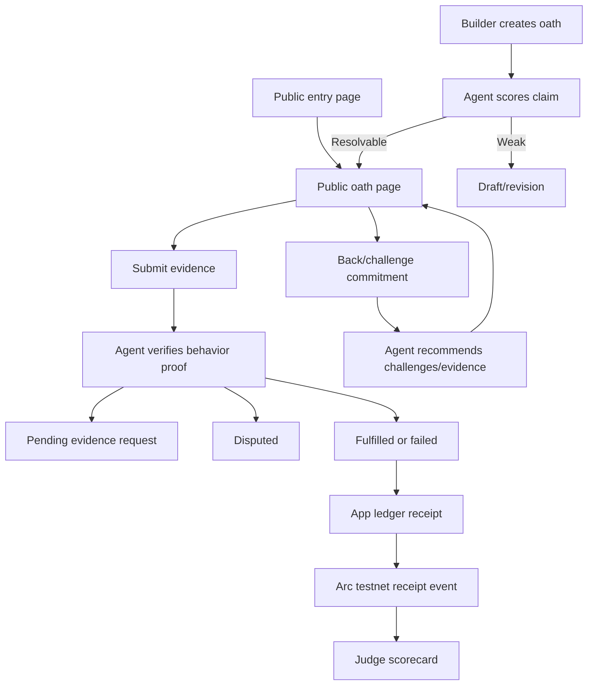

# feat: Build 0ath agent-operated proof markets

## Summary

Build 0ath as an agent-operated proof-of-ship market for Agora builders. The app must give judges a public entry surface, live oath pages, participant backing/challenge activity, behavior-level evidence review, agent market-operation decisions, and at least one Arc testnet notarized settlement receipt.

The plan assumes a strong parallel engineering team. The constraint is not raw build capacity; it is whether the submission shows credible market activity, real agent agency, verifiable Arc/Circle usage, and a judge-readable story before May 25.

---

## Problem Frame

The corrected requirements establish 0ath as more than a proof page. It must create and operate a market around whether a builder ships a concrete claim. Builders provide supply, participants add backing/challenge/evidence, and the agent actively shapes the market by scoring claim quality, identifying evidence gaps, requesting proof, downgrading weak claims, and notarizing outcomes.

The biggest product risk is cold start. If external builder supply is thin, the product must still win as a judge-first proof surface through our own high-quality oath, real market activity, visible agent decisions, and Arc receipt proof. The implementation must therefore support both the builder-first path and the judge-first fallback from day one.

---

## Planning Decisions

- **Arc artifact:** Use a receipt-only Arc testnet smart contract event as the required verifiable artifact. The event notarizes hashes and metadata; it never custodies funds.
- **Agent market actions:** P0 agent behavior includes claim-quality scoring, confidence band generation, evidence-gap detection, challenge/evidence recommendations, missing-proof requests, and at least one downgrade/block against an insufficient builder success assertion.
- **Traction path:** Seed our own 0ath oath, then recruit participants through Canteen Discord, Arc builder Discord, and direct Agora builder outreach. If the traction gate is missed, the submission leads with the judge-first proof surface and labels seeded/demo activity honestly.
- **Behavior proof lane:** P0 automated proof focuses on repo URL, deployment URL, Arc transaction hash, and invocation/log evidence. Screenshots and notes are supporting evidence only.
- **Identity posture:** Public read access; every write requires explicit actor identity plus role-appropriate authorization. P0 may use app-level identity labels only when paired with invite/admin gating; wallet/GitHub sign-in is a stronger option if setup is fast.
- **Evidence safety:** Submitted evidence is untrusted. The P0 plan stores and displays evidence conservatively, verifies claimed sources where practical, and avoids blind rendering/fetching of risky content.
- **Persistence:** Use Neon Postgres provisioned through Vercel Marketplace as the P0 deployed source of truth. Seed fallback is read-only outside local development.

---

## Requirements Trace

**Origin:** `docs/brainstorms/2026-05-22-0ath-requirements.md`

- Oath creation: R1, R2, R3; F1; AE1
- Public judge surface and traction: R13, R14, R15, R16; F0; AE6
- Backing/challenge/accountability: R4, R5, R6, R17, R18; F2; AE2
- Evidence and verification: R7, R8, R9, R10, R19, R20, R21; F3, F4; AE3, AE4, AE7
- Agent market operation: R24, R25; F1, F3, F4; AE8
- Settlement and Arc receipts: R11, R12, R22, R23; F5; AE5
- Access and abuse controls: R26, R27; AE7
- Stretch: R28, R29

---

## Scope Boundaries

### In Scope for P0

- Public product entry page with active/resolved oaths and traction metrics.
- Public oath pages with judge summary block, proof checklist, evidence trail, market activity, agent reasoning, and settlement receipt.
- Authenticated or explicitly identified write actions for creation, backing, challenge, evidence, and resolution requests.
- App-ledger commitments in demo/testnet USDC terms, labeled clearly.
- Agent market operation and deterministic verification logic.
- Receipt-only Arc testnet contract or equivalent onchain write path with ArcScan-visible transaction.
- Our own high-quality oath plus participant activity and judge-first fallback.
- README, demo checklist, traction/outreach notes, and video-ready demo path.

### P1 Stretch

- Circle Nanopayments/x402 evidence bounties.
- Richer LLM evidence analysis beyond deterministic checks.
- Broader proof-source automation.
- Signed public agent feeds.
- Wallet/GitHub sign-in if not needed for P0 identity.

### Out of Scope

- Real-money mainnet funds, custody, KYC, or production compliance.
- Payout contracts that hold user funds.
- Polymarket clone mechanics, sports/politics/token markets, or broad public prediction market verticals.
- Fully decentralized oracle governance, appeals, or juries.
- Automated Discord/X scraping.
- Simulator-only blockchain claims.

---

## External References

- Agora official brief: https://agora.thecanteenapp.com/
- Arc docs: https://docs.arc.io/
- Arc testnet connection details: https://docs.arc.io/arc/references/connect-to-arc
- Arc deployment guide: https://docs.arc.io/integrate/deploy-on-arc
- Circle Nanopayments buyer quickstart: https://developers.circle.com/gateway/nanopayments/quickstarts/buyer
- Circle Nanopayments batched settlement: https://developers.circle.com/gateway/nanopayments/concepts/batched-settlement
- Vercel storage overview: https://vercel.com/docs/storage

---

## Technical Shape

Use a greenfield Next.js app with TypeScript. Keep the P0 system boring where possible: Next.js App Router route handlers, a small domain layer, Neon Postgres for deployed state, deterministic agent rules, and a minimal Foundry contract for receipt notarization.

The contract is not the market ledger. The web app owns the demo/testnet market ledger and writes receipt metadata to Arc testnet when an oath resolves. That separation keeps the demo reliable while still giving judges a real onchain artifact.



---

## Bootstrap Baseline

P0 uses:

- Package manager: `pnpm`
- App framework: Next.js App Router with TypeScript, Tailwind, ESLint
- Tests: Vitest for unit/integration, Playwright for e2e/browser proof
- Contracts: Foundry under `contracts/`
- Deploy target: Vercel
- Deployed persistence: Neon Postgres through Vercel Marketplace

Canonical commands:

```text
pnpm dev
pnpm lint
pnpm typecheck
pnpm test
pnpm test:e2e
pnpm build
pnpm contracts:test
pnpm contracts:deploy:arc
pnpm check
```

U0 owns creation of `package.json`, `pnpm-lock.yaml`, `.gitignore`, `.env.example`, `tsconfig.json`, `next.config.ts`, `vitest.config.ts`, `playwright.config.ts`, and the Foundry baseline. If `forge` is unavailable locally, U0 installs Foundry following the Arc deployment docs before U8 contract work starts.

---

## Data Store Contract

Neon Postgres is the P0 source of truth for deployed writes. The store layer exposes typed functions from `lib/data/store.ts`; UI and agent code must not write seed fixtures directly.

- Required env vars: `DATABASE_URL`, `ADMIN_INVITE_CODE`, `ARC_TESTNET_RPC_URL`, `ARC_RECEIPT_CONTRACT_ADDRESS`, and server-only `ARC_TESTNET_PRIVATE_KEY`.
- Local mode: may use deterministic seed data and/or a local SQLite/Postgres adapter, but all seed records must be marked `source: "seed"`.
- Production mode: all writes use Neon Postgres. Seed fallback is read-only and visibly labeled.
- IDs: use stable generated IDs for oaths, participants, evidence, reviews, requests, and receipts.
- Atomicity: position, evidence, review, receipt, and participant updates must be single store operations or transaction-wrapped updates.
- Real participant counting: `participant.realParticipant` is true only when the participant has a stable ID, canonical display label, and invite/admin approval or equivalent verification.
- Pre-demo check: export or snapshot current production store state before recording so traction, receipt, and seed/demo labels can be audited.

---

## API Contracts

All API routes use JSON, validate the actor identity, and return structured errors. Client-supplied final status is never trusted.

| Route | Method | Auth | Request | Response | Notes |
|------|--------|------|---------|----------|-------|
| `app/api/oaths/route.ts` | `POST` | verified builder or admin invite | claim, deadline, proof requirements, stake terms, behavior criteria, builder identity | created draft or published oath plus claim feedback | unverified/anonymous submissions stay unpublished drafts |
| `app/api/oaths/[id]/positions/route.ts` | `POST` | authorized participant | side, amount, participant ID/label, optional note, idempotency key | position receipt and updated totals | rejects resolved oaths, duplicate idempotency keys, zero/negative amounts |
| `app/api/oaths/[id]/evidence/route.ts` | `POST` | authorized builder/evidence contributor | evidence type, URL/text/log reference, linked evidence request, sensitivity acknowledgement | evidence record with pending/accepted/rejected/quarantined/redacted state | untrusted by default; no blind rendering |
| `app/api/oaths/[id]/review/route.ts` | `POST` | server-side agent or admin only | review trigger, optional evidence request ID | review record, confidence band, recommendations, proposed status | rejects participant callers; computes status from stored evidence only |
| `app/api/oaths/[id]/resolve/route.ts` | `POST` | server-side agent or admin only | review ID and idempotency key | receipt state and Arc notarization state | cannot accept client-supplied final status |

Each route must define nil/empty/error behavior in tests: missing oath, wrong actor, invalid transition, store write failure, duplicate idempotency key, and stale request.

---

## Evidence Contract

P0 fulfilled status requires all of:

- Repo URL: public GitHub repo URL, reachable or syntactically valid when live fetch is unavailable, with expected project identity.
- Deployment URL: public URL or submitted live demo URL tied to the oath claim.
- Arc transaction hash or ArcScan URL: Arc testnet-shaped transaction or receipt reference tied to the claimed settlement/proof path.
- Invocation/log evidence: a structured text/log artifact showing the agent action, input, output, timestamp, and relation to the transaction or deployed app behavior.

Status outcomes:

- `fulfilled`: all required proof categories are present and internally consistent.
- `pending-evidence`: one or more required categories are missing or only supporting evidence is present.
- `disputed`: credible counter-proof, contradictory evidence, or mismatched repo/deploy/Arc/invocation linkage.
- `failed`: deadline miss or proof shows the claim did not occur.

Screenshots and notes are supporting-only unless corroborated by the required proof lane.

---

## Receipt Lifecycle

Resolution is two-phase:

1. `review_decided`: agent review stores policy version, canonical evidence snapshot, normalized input hash, output hash, reasoning hash, and proposed terminal status.
2. `receipt_pending`: app creates a deterministic receipt ID/hash from the review, ledger totals, participant commitments, and evidence hashes.
3. `arc_pending`: app submits the receipt metadata hash to Arc testnet.
4. `arc_confirmed`: app stores tx hash, chain ID, explorer URL, block/timestamp if available, and labels the receipt as live Arc testnet.
5. `arc_failed_retryable`: app preserves the local receipt and exposes retry/reconciliation without claiming Arc notarization.

The public page may show an app-ledger receipt at `receipt_pending`, but it may not label the receipt Arc-notarized until `arc_confirmed`. Repeated review/resolve calls must be idempotent against the same receipt ID.

---

## Judge-Safe UI States

**Oath scorecard states:** not reviewed, review pending, pending-evidence, disputed, fulfilled, failed, Arc pending, Arc unavailable, simulated/app-ledger receipt only, live testnet receipt linked. Above the fold, status and Arc receipt labels must be more prominent than secondary metrics.

**Dashboard states:** loading, no oaths, no real participants, seed/demo-only activity, traction gate missed, traction gate met, Arc receipt unavailable, metric fetch failure, mobile compact layout.

**Evidence states:** pre-submit warning, submitted pending review, accepted, rejected, quarantined/inert display, redaction requested, removed/redacted, failed submission with retry, evidence-request matched, evidence-request closed.

**Accessibility checks:** public entry, oath page, position confirmation, evidence submission, and dashboard must support keyboard-only operation, visible focus, semantic headings, status/receipt labels readable to assistive tech, announced form errors/success states, and mobile touch targets.

---

## Arc Runbook

- Chain ID: `5042002`
- RPC: `https://rpc.testnet.arc.network`
- Explorer: `https://testnet.arcscan.app`
- Gas currency: testnet USDC
- Faucet: Circle faucet for Arc Testnet
- Local env: `ARC_TESTNET_RPC_URL`, `ARC_TESTNET_PRIVATE_KEY`, `ARC_RECEIPT_CONTRACT_ADDRESS`
- Deploy: Foundry `forge create`/script deploy using `--rpc-url $ARC_TESTNET_RPC_URL --private-key $ARC_TESTNET_PRIVATE_KEY --broadcast`
- After deploy: store contract address in server env only, link deploy tx in README/demo checklist, and verify on ArcScan.
- Signer policy: use a minimally funded testnet-only wallet; keep private key server-only; never expose to client bundles/logs; rotate immediately if leaked; use separate local and deployed credentials.
- Gate 2 verification: deployed app receipt includes chain ID `5042002`, testnet USDC label, ArcScan URL, and matching receipt hash.

---

## Output Structure

```text
.env.example
.gitignore
app/
  page.tsx
  layout.tsx
  globals.css
  oaths/
    new/page.tsx
    [id]/page.tsx
  dashboard/page.tsx
  api/
    oaths/route.ts
    oaths/[id]/positions/route.ts
    oaths/[id]/evidence/route.ts
    oaths/[id]/review/route.ts
    oaths/[id]/resolve/route.ts
components/
  oath/
  ui/
contracts/
  foundry.toml
  script/DeployOathReceipt.s.sol
  src/OathReceipt.sol
  test/OathReceipt.t.sol
docs/
  demo-checklist.md
  outreach.md
  traction-log.md
lib/
  agent/
  arc/
  data/
  domain/
  security/
next.config.ts
playwright.config.ts
pnpm-lock.yaml
tests/
  unit/
  integration/
  e2e/
README.md
tsconfig.json
vitest.config.ts
```

Exact framework files may shift during implementation, but these are the ownership boundaries the plan expects.

---

## Parallel Workstreams

- **Stream 0: Bootstrap** owns U0 and must land before other implementation streams share commands or dependencies.
- **Stream A: Product surface** owns U1, U3, U4, and U5 UI surfaces.
- **Stream B: Data and domain** owns U2 and supports every stream.
- **Stream C: Evidence and agent** owns U6 and U7.
- **Stream D: Arc receipt path** owns U8.
- **Stream E: Traction and submission** owns U9 docs/dashboard. Outreach drafts can start early; external outreach waits for Gate 4.
- **Stream F: Stretch monetization** owns U10 only after Streams A-D are working.

Early parallelism is allowed only where dependencies are real: U8 may begin contract/schema scaffolding before app integration, and U9 may begin README/outreach/checklist drafts before external outreach. U7 integration waits for U2, U3, U5, and U6; full U8 app integration waits for U7 receipt payloads; U9 dashboard/demo-flow work waits for the market/evidence/review/receipt path.

Daily integration target: the public judge path must remain runnable from entry page to oath page to evidence review to receipt.

---

## Implementation Units

### U0. Bootstrap repository baseline

**Goal:** Establish the greenfield app and contract baseline so all streams share the same toolchain, commands, and environment shape.

**Requirements:** Supports all implementation units

**Dependencies:** None

**Files:**
- Create: `package.json`
- Create: `pnpm-lock.yaml`
- Create: `.gitignore`
- Create: `.env.example`
- Create: `tsconfig.json`
- Create: `next.config.ts`
- Create: `vitest.config.ts`
- Create: `playwright.config.ts`
- Create: `contracts/foundry.toml`
- Create: `README.md`

**Approach:**
- Initialize a Next.js App Router project in the repo root with TypeScript, Tailwind, ESLint, and pnpm.
- Add Vitest and Playwright configuration.
- Add Foundry contract baseline under `contracts/`; if `forge` is not installed locally, install Foundry before U8 starts.
- Add canonical scripts: `dev`, `lint`, `typecheck`, `test`, `test:e2e`, `build`, `contracts:test`, `contracts:deploy:arc`, and `check`.
- Add `.env.example` with non-secret names only.
- Initialize git if the workspace is still not a repository.

**Test scenarios:**
- Happy path: `pnpm check` can run the available checks after scaffold.
- Happy path: `pnpm contracts:test` works once the Foundry baseline exists.
- Safety: `.env` and private keys are ignored by git.

**Verification:**
- All streams can use the same commands and config files before feature work begins.

### U1. Scaffold app shell and public judge entry

**Goal:** Create the app shell and public entry surface that makes the product understandable without a walkthrough.

**Requirements:** R3, R13, R14, R15, R16; F0; AE6

**Dependencies:** None

**Files:**
- Create: `app/layout.tsx`
- Create: `app/page.tsx`
- Create: `app/globals.css`
- Create: `components/ui/`
- Create: `components/oath/traction-summary.tsx`
- Create: `components/oath/oath-list.tsx`
- Test: `tests/e2e/public-entry.spec.ts`

**Approach:**
- Build the first screen as the usable product, not a marketing landing page.
- Show top metrics, strongest active/resolved oath, Arc receipt status, and calls to create/back/challenge.
- Use dense, work-focused information design. Avoid generic gradient SaaS hero patterns.
- Include seed data from U2 as soon as available; before U2 lands, render a stable empty/loading state.

**Test scenarios:**
- Happy path: unauthenticated visitor can see public entry, traction summary, oath list, and navigation to an oath.
- Edge case: no oaths yet shows a credible empty state and still explains the product loop.
- Responsive: mobile and desktop entry pages do not overlap text or hide the primary oath path.

**Verification:**
- Playwright opens `/` and reaches at least one oath page without sign-in.

---

### U2. Define domain model, seed data, and persistence

**Goal:** Establish the source of truth for oaths, positions, evidence, agent reviews, evidence requests, receipts, identities, and traction metrics.

**Requirements:** P0 state only: R1-R27 where state applies, especially R10, R13, R14, R17, R18, R22, R26, R27. Excludes R28/R29 stretch state, which belongs to U10.

**Dependencies:** U1 can start in parallel; U2 should stabilize before API wiring.

**Files:**
- Create: `lib/domain/oath.ts`
- Create: `lib/domain/position.ts`
- Create: `lib/domain/evidence.ts`
- Create: `lib/domain/review.ts`
- Create: `lib/domain/receipt.ts`
- Create: `lib/domain/identity.ts`
- Create: `lib/data/schema.ts`
- Create: `lib/data/store.ts`
- Create: `lib/data/seed.ts`
- Create: `lib/data/neon-store.ts`
- Create: `lib/data/local-store.ts`
- Test: `tests/unit/domain.test.ts`
- Test: `tests/unit/store.test.ts`
- Test: `tests/unit/traction-metrics.test.ts`

**Approach:**
- Model statuses exactly as the requirements: draft/revision, active, pending-evidence, disputed, fulfilled, failed.
- Treat fulfilled and failed as terminal. Pending-evidence and disputed have no final payout direction.
- Store all financial language as demo/testnet USDC-denominated commitments with explicit source labels.
- Use Neon Postgres as the deployed production store; keep deterministic seed fallback read-only outside local development.
- Define store functions for oaths, participants, positions, evidence, reviews, evidence requests, receipts, and traction metrics before API work starts.
- Require stable participant IDs, canonical display labels, optional verified wallet/GitHub fields, deduplication rules, and `realParticipant` for Gate 1 metrics.
- Seed one first-party 0ath oath with real-looking proof requirements, one supporter, one challenger, one missing-proof request, one evidence submission, one downgrade case, and one resolved receipt placeholder.

**Test scenarios:**
- Happy path: creating an active oath requires concrete claim, deadline, proof requirements, stake terms, and behavior criteria.
- Error path: invalid status transitions are rejected.
- Edge case: duplicate evidence does not inflate traction metrics.
- Happy path: traction metrics separate real participant activity from seed/demo activity.
- Happy path: receipt objects carry simulated/testnet/live labels.
- Error path: production store write failure returns structured errors without mutating seed data.
- Gate path: participant counts use `realParticipant`, not raw labels or duplicated handles.

**Verification:**
- Unit tests prove lifecycle, metric, and label invariants before UI/API integration depends on them.

---

### U3. Build oath creation and claim-quality revision loop

**Goal:** Let builders create resolvable oaths and force weak claims into draft/revision before publication.

**Requirements:** R1, R2, R3, R8, R15; F1; AE1

**Dependencies:** U1, U2

**Files:**
- Create: `app/oaths/new/page.tsx`
- Create: `app/api/oaths/route.ts`
- Create: `components/oath/oath-form.tsx`
- Create: `components/oath/claim-feedback.tsx`
- Create: `lib/agent/claim-quality.ts`
- Test: `tests/unit/claim-quality.test.ts`
- Test: `tests/integration/oath-creation.test.ts`
- Test: `tests/e2e/oath-create-revision.spec.ts`

**Approach:**
- Require verified builder identity before publication. Invite/admin approval or wallet/GitHub verification must bind the displayed builder label; anonymous/unverified submissions remain unpublished drafts.
- Require claim, deadline, proof checklist, stake terms, and behavior-level success criteria.
- Agent scores concreteness, deadline validity, public verifiability, behavior proof, and Arc relevance.
- Weak claims remain unpublished as draft/revision with actionable feedback.
- Concrete claims publish to a shareable oath page.

**Test scenarios:**
- Covers AE1: vague claim stays unpublished with specific feedback.
- Happy path: concrete claim publishes and appears on public entry.
- Error path: forged builder label or unapproved publisher cannot publish an oath.
- Error path: anonymous submission can be saved only as an unpublished draft/revision.
- Edge case: deadline in the past is rejected.
- Edge case: missing behavior proof keeps the oath in revision.

**Verification:**
- A builder can create the first 0ath oath and get a public URL only after the agent accepts resolvability.

---

### U4. Build public oath page, judge scorecard, and market activity

**Goal:** Render the single most important judging surface: the oath page.

**Requirements:** R3, R5, R6, R14, R16, R17, R18, R22, R23; F2, F4, F5; AE2, AE5, AE6

**Dependencies:** U1, U2; can proceed before U5/U7 with placeholders.

**Files:**
- Create: `app/oaths/[id]/page.tsx`
- Create: `components/oath/oath-scorecard.tsx`
- Create: `components/oath/proof-checklist.tsx`
- Create: `components/oath/commitment-ledger.tsx`
- Create: `components/oath/status-badge.tsx`
- Create: `components/oath/settlement-receipt.tsx`
- Test: `tests/e2e/oath-page.spec.ts`
- Test: `tests/unit/receipt-labels.test.ts`

**Approach:**
- Page hierarchy: status, claim, deadline, proof checklist, agent decision, Arc/USDC receipt status, then evidence/activity details.
- Distinguish real participant activity from seeded/demo fallback data.
- Render simulated/testnet/live labels on every receipt-like element.
- Include redaction/sensitivity warnings wherever public evidence is shown, and hide removed/redacted evidence from public views and reasoning traces while preserving safe hashes/labels.
- Implement judge-safe scorecard states: not reviewed, review pending, pending-evidence, disputed, fulfilled, failed, Arc pending, Arc unavailable, simulated/app-ledger receipt only, and live testnet receipt linked.

**Test scenarios:**
- Happy path: judge can understand claim, status, proof, agent decision, and Arc receipt from the top of the page.
- Edge case: pending-evidence and disputed pages show no final payout direction.
- Edge case: long claims, notes, and URLs wrap without layout breakage.
- Security display: unsafe/private evidence warning appears before public evidence submission/rendering.
- Redaction path: removed/redacted evidence no longer appears publicly, but the timeline still shows a safe redaction marker.

**Verification:**
- Manual browser check plus Playwright screenshot path for desktop/mobile.

---

### U5. Implement backing, challenge, identity, and abuse controls

**Goal:** Make participant activity visible and accountable without pretending demo/testnet commitments are real-money custody.

**Requirements:** R4, R5, R6, R17, R18, R22, R26, R27; F2; AE2, AE7

**Dependencies:** U2, U4

**Files:**
- Create: `app/api/oaths/[id]/positions/route.ts`
- Create: `components/oath/position-actions.tsx`
- Create: `components/oath/identity-gate.tsx`
- Create: `lib/security/abuse-controls.ts`
- Create: `lib/domain/activity.ts`
- Test: `tests/unit/position-ledger.test.ts`
- Test: `tests/unit/abuse-controls.test.ts`
- Test: `tests/integration/oath-position.test.ts`
- Test: `tests/e2e/oath-back-challenge.spec.ts`

**Approach:**
- Use lightweight explicit identity for P0 only with authorization: invite/admin approval or equivalent gating must create a stable participant record before write actions are accepted.
- Participant records must include stable internal ID, canonical display label, optional wallet/GitHub fields, deduplication rules, and `realParticipant` flag for Gate 1.
- Require confirmation before commitment.
- Support pending, success receipt, failure/retry, cancel/no-position, and disabled-resolved states.
- Keep language accountability-focused: back, challenge, commitment, receipt, proof.

**Test scenarios:**
- Covers AE2: backing updates totals, public identity, receipt, and activity.
- Happy path: challenge updates totals and recommendation context.
- Error path: anonymous or suspicious write is blocked or rate-limited.
- Error path: duplicate handle/alias does not count as a new real participant.
- Edge case: zero/negative amounts rejected.
- Edge case: resolved oaths reject new commitments.

**Verification:**
- Public oath page shows meaningful market activity and identity-backed accountability.

---

### U6. Implement evidence submission and safety boundary

**Goal:** Let users submit useful proof while treating external evidence as untrusted.

**Requirements:** R7, R9, R19, R20, R21, R23, R26, R27; F3, F4; AE3, AE4, AE7

**Dependencies:** U2, U4

**Files:**
- Create: `app/api/oaths/[id]/evidence/route.ts`
- Create: `components/oath/evidence-form.tsx`
- Create: `components/oath/evidence-timeline.tsx`
- Create: `components/oath/evidence-request.tsx`
- Create: `components/oath/evidence-redaction.tsx`
- Create: `lib/security/evidence-safety.ts`
- Create: `lib/agent/evidence-classifier.ts`
- Test: `tests/unit/evidence-safety.test.ts`
- Test: `tests/unit/evidence-classifier.test.ts`
- Test: `tests/integration/oath-evidence.test.ts`

**Approach:**
- First-class evidence types: repo URL, deployment URL, Arc tx hash, invocation/log evidence, live demo link.
- Supporting evidence: screenshots and notes, clearly marked non-authoritative unless corroborated.
- Validate URL shape and domain category before display/agent use; avoid blind server-side fetching in P0 unless tightly constrained.
- Evidence requests attach to specific missing proof and remain open or pending-review after matching evidence is submitted; U7 closes them after agent review.
- Evidence states: pre-submit warning, submitted pending review, accepted, rejected, quarantined/inert display, redaction requested, removed/redacted, failed submission with retry, evidence-request matched, evidence-request closed.
- Constrain accepted files/logs with size and MIME allowlists where uploads exist; strip image metadata where practical; render untrusted content inertly; scan pasted logs for common secret patterns.
- Add admin/user redaction-removal path. Removed evidence must not appear publicly or in agent traces.

**Test scenarios:**
- Happy path: repo/deploy/Arc/invocation evidence is accepted and categorized.
- Covers AE7: suspicious or unsafe evidence is rejected, quarantined, or displayed only as inert text.
- Edge case: screenshot-only proof cannot satisfy fulfilled status.
- Happy path: matching evidence marks a request as pending review, and U7 closes it after review.
- Privacy path: redacted/removed evidence disappears from public page and agent trace.

**Verification:**
- Agent inputs are structured and safe enough for deterministic review.

---

### U7. Implement agent market operation and resolution policy

**Goal:** Make the agent visibly decide and operate the market rather than narrating submitted evidence.

**Requirements:** R8, R10, R20, R24, R25; F1, F3, F4; AE3, AE4, AE8

**Dependencies:** U2, U3, U5, U6

**Files:**
- Create: `app/api/oaths/[id]/review/route.ts`
- Create: `app/api/oaths/[id]/resolve/route.ts`
- Create: `components/oath/agent-reasoning.tsx`
- Create: `components/oath/market-recommendations.tsx`
- Create: `lib/agent/market-operator.ts`
- Create: `lib/agent/resolution-policy.ts`
- Create: `lib/agent/reasoning-trace.ts`
- Test: `tests/unit/market-operator.test.ts`
- Test: `tests/unit/resolution-policy.test.ts`
- Test: `tests/unit/reasoning-trace.test.ts`
- Test: `tests/integration/oath-review-resolution.test.ts`
- Test: `tests/e2e/agent-downgrade.spec.ts`

**Approach:**
- Deterministic-first agent rules for P0. LLM copy can improve readability only after rule outputs are stable.
- Review and resolve routes are server-side agent/admin only. Participant or browser callers must not be able to mutate review, receipt, or terminal status.
- The resolve route accepts a review ID and idempotency key only; it computes terminal status from stored review/evidence state and never accepts client-supplied final status.
- Each review stores an agent policy version, ordered canonical evidence snapshot, normalized input hash, output hash, and reasoning hash.
- Market-operation outputs: confidence band, claim quality score, missing proof requests, challenge/evidence recommendations, downgrade/block decisions.
- Resolution rules:
  - fulfilled requires behavior-level proof plus matching repo/deploy/Arc evidence.
  - failed requires deadline miss or contradictory proof.
  - pending-evidence means missing required evidence.
  - disputed means credible counter-proof or unresolved contradiction.
- Matching evidence requests remain pending-review until this unit closes them through a stored review decision.
- Resolution produces `review_decided` and `receipt_pending` states first; U8 is responsible for moving receipts to `arc_pending` and `arc_confirmed`.
- At least one seeded/demo scenario must show the agent rejecting a builder success assertion.

**Test scenarios:**
- Covers AE3: full proof set can produce fulfilled status.
- Covers AE4/R25: artifact-only proof produces pending-evidence and missing-proof request.
- Covers AE8: one-sided market or weak evidence triggers challenge/evidence recommendation.
- Edge case: contradictory evidence produces disputed status.
- Security: unauthenticated users and normal participants cannot review, resolve, or mutate terminal status.
- Determinism: re-ordered equivalent evidence produces the same normalized input hash and status.
- Traceability: review records include policy version, input hash, output hash, reasoning hash, and evidence snapshot reference.
- Idempotency: repeated reviews do not duplicate requests or receipts.

**Verification:**
- Public oath page shows a reasoning trace where the agent changes market state.

---

### U8. Implement Arc testnet receipt notarization

**Goal:** Produce the required Arc artifact: at least one live Arc testnet transaction linked from a settlement receipt.

**Requirements:** R11, R12, R22, R23; F5; AE5

**Dependencies:** U2, U7; contract work can start in parallel once receipt schema is defined.

**Files:**
- Create: `contracts/foundry.toml`
- Create: `contracts/src/OathReceipt.sol`
- Create: `contracts/script/DeployOathReceipt.s.sol`
- Create: `contracts/test/OathReceipt.t.sol`
- Create: `lib/arc/config.ts`
- Create: `lib/arc/receipt-adapter.ts`
- Test: `tests/unit/receipt-adapter.test.ts`
- Test: `tests/integration/settlement-receipt.test.ts`

**Approach:**
- Contract emits a receipt event with oath ID/hash, status, evidence hash, reasoning hash, ledger hash, and timestamp.
- No custody, no payout logic, no user funds.
- App ledger records commitment totals and payout direction through `lib/domain/receipt.ts` and `lib/data/store.ts`; Arc code only submits/stores receipt notarization metadata and does not maintain a second ledger.
- Arc adapter reads the deterministic receipt payload from the domain/data layer after U7 creates `receipt_pending`.
- Arc submission moves the receipt through `arc_pending`, `arc_confirmed`, or `arc_failed_retryable`; failed writes never get labeled as Arc-notarized.
- If a live write fails during local development, the app still renders a clearly labeled app-ledger receipt, but final submission cannot pass Gate 2 without one live ArcScan reference.
- Never commit private keys, faucet secrets, or `.env` values. The signer key is server-only, testnet-only, minimally funded, excluded from client bundles/logs, separated between local and deployed environments, and rotated immediately if exposed.

**Test scenarios:**
- Contract test: records receipt event with expected metadata.
- Adapter happy path: stores tx hash, chain ID, explorer URL, and testnet label.
- Adapter error path: failed write leaves local receipt intact and marks Arc notarization unavailable.
- Security: Arc private key/config is not exposed through public env, serialized page props, or client bundles.
- Idempotency: duplicate submission for the same receipt ID does not create conflicting receipt records.
- Receipt display: live/testnet/simulated labels are unambiguous.

**Verification:**
- At least one receipt in the deployed app links to an Arc testnet transaction or contract artifact.

---

### U9. Build traction dashboard, outreach assets, and submission package

**Goal:** Turn the product into a judge-ready submission with visible traction and honest fallback labeling.

**Requirements:** R13, R14, R15, R16; Success Criteria; Stop Gates

**Dependencies:** U1, U2, U4 for dashboard/docs. U5 and U6 must pass Gate 4 before external outreach. U7 and U8 must exist before final demo-flow packaging.

**Files:**
- Create: `app/dashboard/page.tsx`
- Create: `components/oath/traction-dashboard.tsx`
- Create: `docs/outreach.md`
- Create: `docs/traction-log.md`
- Create: `docs/demo-checklist.md`
- Create: `README.md`
- Test: `tests/e2e/demo-flow.spec.ts`

**Approach:**
- Dashboard shows real participants, seed/demo labels, backing/challenge counts, evidence submissions, resolved oaths, and Arc receipt status.
- Dashboard implements loading, no real participants, seed/demo-only, traction gate missed, traction gate met, Arc unavailable, metric fetch failure, and mobile compact states.
- Outreach doc contains short messages for Canteen Discord, Arc builder Discord, and direct builders. Drafts can start early, but posting/direct outreach waits until identity, abuse, and evidence safety controls pass Gate 4.
- Traction log records who tried it, what action they took, what friction appeared, and whether the action was real or seeded.
- README leads with judge path, live link, Arc receipt, agent agency, setup, and limitations.
- Demo checklist enforces all five stop gates before video recording and records pass/fail evidence from product data, tests, and ArcScan.

**Test scenarios:**
- Happy path: dashboard aggregates metrics from seed and live data.
- Happy path: demo flow covers entry, oath, back/challenge, evidence, review, receipt, dashboard.
- Edge case: if traction gate is missed, public copy labels fallback/demo data honestly.
- Edge case: dashboard still gives a judge-safe story when Arc is temporarily unavailable or metrics fetch fails.
- Documentation check: README judge path matches actual routes.

**Verification:**
- A reviewer can inspect the product and repo without private guidance.

---

### U10. Add Circle Nanopayments/x402 evidence bounty stretch

**Goal:** Prototype real evidence-bounty settlement only after the P0 loop and Arc receipt path are stable.

**Requirements:** R9, R28

**Dependencies:** U6, U8

**Files:**
- Create: `lib/circle/nanopayments.ts`
- Create: `components/oath/evidence-bounty.tsx`
- Test: `tests/unit/evidence-bounty.test.ts`

**Approach:**
- Preserve evidence requests without this unit.
- If implemented, tie bounties to missing-proof requests only.
- Never let bounty mechanics alter oath resolution status by themselves.

**Test scenarios:**
- Happy path: missing-proof request can display USDC-denominated bounty intent.
- Error path: unavailable Nanopayments setup keeps the request visible and clearly labeled.
- Invariant: bounty state does not mark an oath fulfilled.

**Verification:**
- If incomplete, no P0 stop gate is affected.

---

## Critical Integration Path

1. U0 establishes the shared app, test, contract, and command baseline.
2. U1 + U2 produce a public entry with seed oath data.
3. U3 + U4 produce public oath creation and judge-readable oath pages.
4. U5 + U6 add accountable market activity and safe evidence.
5. U7 makes agent decisions visible and creates the downgrade/missing-proof moment.
6. U8 notarizes a resolved receipt on Arc testnet.
7. U9 packages traction, outreach, README, demo checklist, and final judge path.

Parallel work is expected, but final integration must prove this path end to end.

---

## Stop Gates Before Demo Recording

- Gate 1, builder supply: If fewer than 3 real participants/teams interacted, lead with judge-first fallback and label seed/demo data.
- Gate 2, Arc credibility: If no live Arc testnet receipt/transaction link exists, do not record the final demo.
- Gate 3, agent agency: If the agent cannot downgrade/block/request proof against an insufficient success assertion, do not record the final demo.
- Gate 4, evidence safety: If state-changing actions are anonymous/unbounded or unsafe evidence is blindly trusted, do not start outreach.
- Gate 5, demo freeze: Before recording, freeze the exact production URL, seed/live data snapshot, Arc receipt link, README judge path, and three-minute video route in `docs/demo-checklist.md`.

---

## Test Strategy

- Unit tests: domain lifecycle, claim quality, market-operation rules, resolution policy, evidence safety, receipt labeling, Arc adapter.
- Integration tests: oath creation, position update, evidence submission, review/resolution, settlement receipt.
- E2E tests: public entry, oath create/revision, back/challenge, evidence/review, agent downgrade, demo flow.
- Manual browser proof: desktop and mobile public entry, oath page, dashboard, and receipt pages.
- Accessibility proof: keyboard-only pass, visible focus, semantic headings, announced form errors/success states, readable status/receipt labels, and mobile touch target check on public entry, oath page, position action, evidence submission, and dashboard.
- Demo gate proof: `docs/demo-checklist.md` must map each stop gate to the product data, test, screenshot, or ArcScan link that proves it passed or explains the judge-first fallback.
- Contract tests: Foundry tests for receipt-only contract event behavior.

---

## Risks & Mitigations

| Risk | Mitigation |
|------|------------|
| Builder supply is weak | Build judge-first fallback and seed our own resolved oath from day one. |
| Arc integration slips | Start U8 contract/schema work early; integrate after U7 receipt payloads exist; keep contract receipt-only; make one live ArcScan reference a stop gate. |
| Agent looks like narration | Require market-operation outputs and a visible downgrade/block scenario. |
| Demo/testnet USDC feels fake | Use public identity, signed/app receipts, visible history, and clear network labels. |
| Evidence is unsafe or spoofed | Treat evidence as untrusted, verify source categories, avoid blind rendering, and mark screenshots/notes supporting-only. |
| Product reads like gambling | Keep accountability language and avoid odds-first betting UI. |
| Scope expands into prediction markets | Keep P0 tied to builder shipping oaths only. |

---

## Documentation Requirements

- `README.md` must include problem, product loop, judge path, live link, Arc receipt link, agent agency example, setup, and limitations.
- `docs/demo-checklist.md` must include the five stop gates, exact video path, production URL, data snapshot timestamp, and ArcScan receipt link.
- `docs/outreach.md` must include outreach copy and target channels.
- `docs/traction-log.md` must track real versus seed/demo actions.
- All docs must avoid claiming real-money settlement or mainnet value.

---

## Ready for ce-work When

- This plan passes `ce-doc-review`.
- The team accepts the stop gates.
- The first implementation pass starts with U0. After U0, start U1 and U2; U8 may begin contract/schema scaffolding and U9 may draft README/outreach/checklist. Start U3/U4/U5 after U1/U2 surfaces exist, U6 after U2/U4, U7 after U2/U3/U5/U6 schemas exist, U8 app integration after U7 receipt payloads exist, external outreach after Gate 4, and U9 demo packaging after the market/evidence/review/receipt path works.
